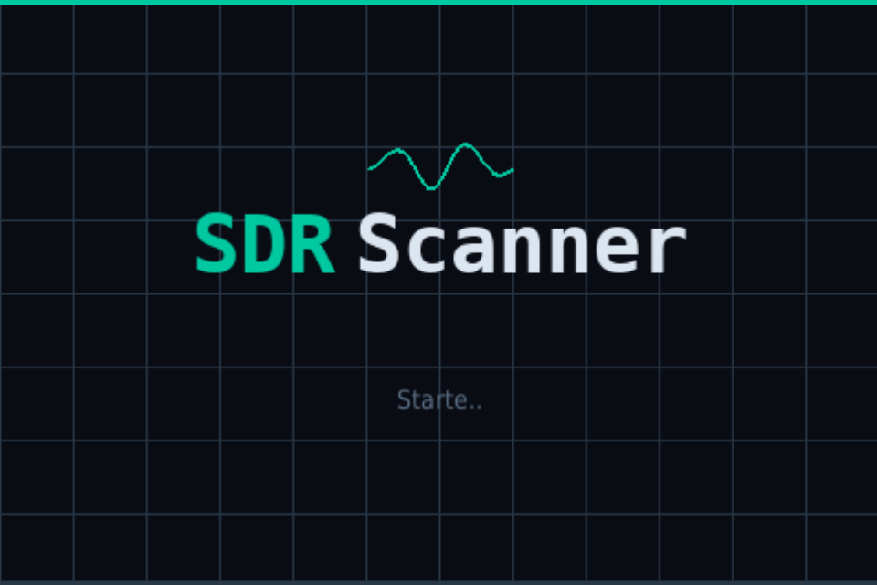
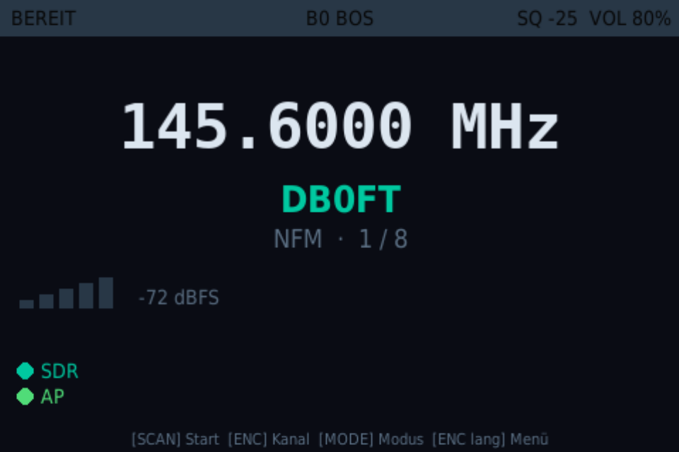
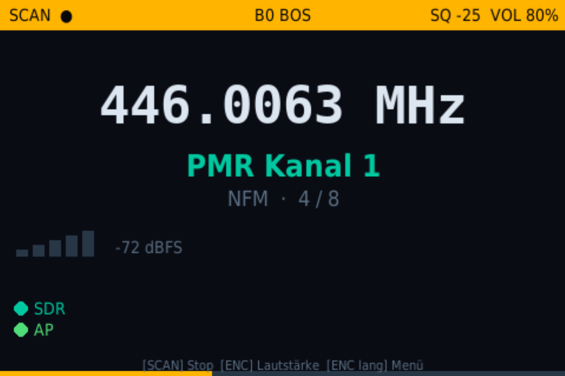
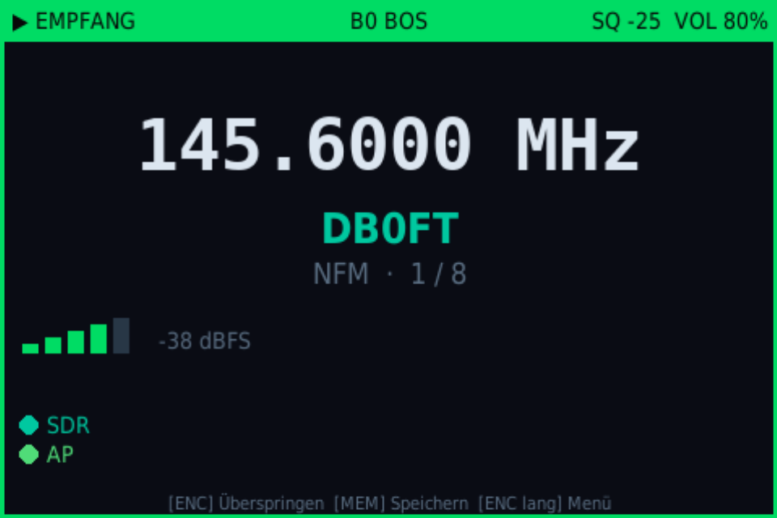
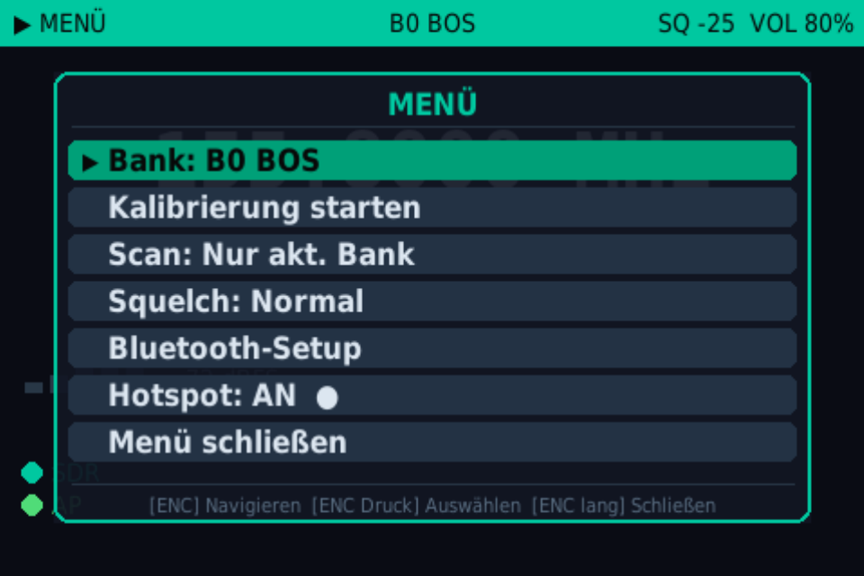
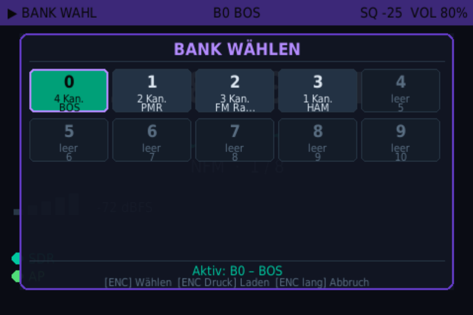
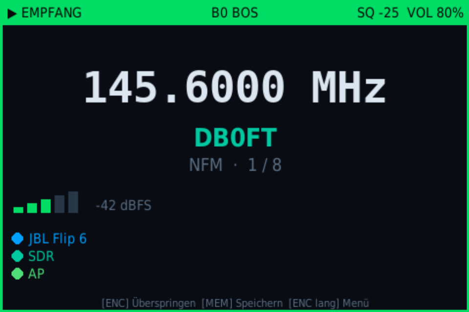

# RPi SDR Scanner

Kompakter Tischscanner auf Basis eines Raspberry Pi, eines RTL-SDR-Dongles und einem 3,5"-SPI-Touchscreen. Vorkonfigurierte Kanäle scannen, Memory-Bänke verwalten, manuell abstimmen — steuerbar über physische Tasten, einen Drehgeber oder ein Web-Interface per WLAN-Hotspot. Audio wahlweise über den lokalen 3,5-mm-Ausgang oder einen **Bluetooth-A2DP-Lautsprecher**.

---

## Hardware

| Komponente | Details |
|-----------|---------|
| SBC | Raspberry Pi 3B+ oder Zero 2 W |
| SDR-Dongle | NooElec NESDR SMArt v5 (RTL-SDR) |
| Display | MHS 3,5" IPS SPI (480×320, ILI9486-Controller, XPT2046-Touch) |

---

## Features

- **Kanalscanner** — scannt eine konfigurierbare Kanalliste, bleibt bei aktivem Signal stehen
- **Memory-Bänke** — 10 benannte Bänke, persistent in SQLite
- **Boot-Splash** — animierter Startbildschirm auf dem SPI-Display während der Scanner lädt (`sdr_splash.service`)
- **Demodulationsmodi** — NFM, FM, WFM, AM (direkt via pyrtlsdr, schneller Kanalwechsel ~10 ms)
- **Squelch-Regelung** — einstellbare Schwelle mit Hysterese, Signal-Balkenanzeige und Schnell-Presets
- **Monitor-Taste** — Squelch solange gedrückt halten zwangsweise öffnen (Mithören ohne Signal)
- **Kanalnamen-Ansage** — kurzer MEM-Druck liest den aktuellen Kanalnamen vor (pico2wave / RHVoice / MBROLA / espeak-ng)
- **Amateurfunk-Rufzeichen** — Rufzeichen (z. B. DB0VA) werden automatisch erkannt und im NATO-Phonetik-Alphabet vorgelesen (*Delta Bravo Zero Victor Alpha*)
- **Bluetooth-Audio** — A2DP-Lautsprecher koppeln, verbinden und automatisch wiederherstellen; integrierter Wizard im Display-Menü
- **SDR-Dongle-Indicator** — Display zeigt Verbindungsstatus des RTL-SDR-Dongles; bei Trennung automatischer Reconnect mit Jingle-Ton
- **PPM-Kalibrierung** — integrierte Kalibrierung via `kalibrate-rtl`, Ergebnis wird automatisch gespeichert
- **Web-UI** — Vollzugriff per Flask + SSE auf `http://scanner.local:5000`
- **WLAN-Hotspot** — Pi als eigener Accesspoint (SSID: `SDR-Scanner`)
- **Touch-Menü** — Tippen auf die Hauptanzeige öffnet ein Schnellzugriffsmenü
- **HDMI-Modus** — skalierbares Vorschaufenster zur Entwicklung ohne SPI-Display

---

## Screenshots

| Boot-Splash | Bereit (IDLE) |
|:-----------:|:-------------:|
|  |  |

| Scan läuft | Signal empfangen |
|:----------:|:----------------:|
|  |  |

| Menü | Bank-Auswahl |
|:----:|:------------:|
|  |  |

| Empfang mit Bluetooth-Lautsprecher |
|:----------------------------------:|
|  |


*Web-Oberfläche (erreichbar über WLAN-Hotspot)*

---

## Projektstruktur

```
sdr_scanner/
├── main.py                  # Einstiegspunkt, CLI-Argumente
├── splash.py                # Boot-Splash für SPI-Display (sdr_splash.service)
├── start_scanner.sh         # Startscript für systemd (SDL/PA/BT-Umgebung)
├── sdr_scanner.service      # systemd-Unit für den Scanner
├── sdr_splash.service       # systemd-Unit für den Boot-Splash
├── config/
│   └── settings.py          # Alle Konfigurationswerte
├── core/
│   ├── scanner.py           # Haupt-Controller, Event-Loop, Zustandsmaschine
│   ├── frequency.py         # Kanalliste, Scan-Navigation
│   ├── squelch.py           # RSSI-Auswertung, Squelch-Logik
│   ├── demodulator.py       # pyrtlsdr-Wrapper (persistent USB, ~10 ms Retune)
│   ├── audio.py             # PCM → PulseAudio Pipeline (PyAudio / aplay)
│   ├── bluetooth.py         # BlueZ/D-Bus Wrapper für BT-A2DP-Audio
│   ├── memory_banks.py      # 10 Memory-Bänke, SQLite-Persistenz
│   ├── bookmarks.py         # Empfangs-Log, DB-Verbindung
│   ├── buttons.py           # GPIO-Handler + ButtonEvent-Enum
│   └── calibration.py       # PPM-Kalibrierung via kalibrate-rtl
├── ui/
│   ├── display.py           # pygame Framebuffer-UI + Overlays + BT-Wizard
│   └── web.py               # Flask + SSE, 21 REST-Endpunkte
├── hotspot/
│   ├── setup_hotspot.sh     # Hotspot einrichten (von postinst und install.sh gerufen)
│   ├── hotspot_start.sh     # Von systemd beim Boot aufgerufen
│   ├── hotspot_stop.sh
│   └── change_wifi.sh       # SSID/Passwort per CLI ändern
```

---

## Verdrahtung

Alle Buttons und der Encoder liegen im **unteren Header-Block (Pins 29–40)** — konfliktfrei mit dem MHS/ILI9486 SPI-Display, das Pins 11–26 belegt.

### Buttons (Pull-Up, gegen GND schalten)

| Funktion | BCM | Phys. Pin | GND-Pin |
|----------|-----|-----------|---------|
| Monitor  | 16  | 36        | 39      |
| Mode     | 19  | 35        | 39      |
| Memory   | 20  | 38        | 39      |
| Squelch+ | 21  | 40        | 39      |
| Squelch− | 26  | 37        | 39      |

### Rotary Encoder

| Signal   | BCM | Phys. Pin | Hinweis |
|----------|-----|-----------|---------|
| VCC      | 12  | 32        | GPIO als 3,3V-Ausgang |
| A        | 5   | 29        | — |
| B        | 6   | 31        | — |
| SW (Taster) | 13 | 33     | — |
| GND      | –   | 30 / 34   | beide GND-Pins nutzbar |

### Display (MHS 3,5" SPI / ILI9486)

Direkter Aufsteck-Header (GPIO 7–11, 17, 18, 25, 27). Kompatibel mit dem `waveshare35a`-Kernel-Overlay (gleicher Chip + Pinout), wird von `install.sh` automatisch konfiguriert.

### RTL-SDR Dongle

Einfach per USB an den Pi anstecken. Bei Problemen mit dem Standard-DVB-Treiber:
```bash
echo 'blacklist dvb_usb_rtl28xxu' | sudo tee /etc/modprobe.d/blacklist-rtl.conf
```

---

## Installation

### Voraussetzungen

- Raspberry Pi OS Lite 64-bit (Bookworm) auf einer SD-Karte
- SSH-Zugang oder direkter Terminalzugriff auf dem Pi

### Option A – .deb-Paket (empfohlen)

Direkt auf dem Pi ausführen — lädt automatisch das neueste Release von GitHub:

```bash
curl -sL \
  "$(curl -s https://api.github.com/repos/FelixLenz-Code/rpi-sdr-scanner/releases/latest \
     | grep -o 'https://[^"]*_arm64\.deb')" \
  -o /tmp/sdr-scanner.deb \
&& sudo dpkg -i /tmp/sdr-scanner.deb \
&& sudo apt-get install -f
```

Nach der Installation startet der Scanner automatisch. Web-UI erreichbar unter **http://scanner.local:5000** (Hotspot `SDR-Scanner`, Passwort: `sdrscanner`).

### Option B – ZIP + install.sh

```bash
# ZIP auf den Pi übertragen
scp sdr_scanner.zip pi@<ip>:/home/pi/

# Auf dem Pi entpacken und installieren
cd /home/pi && unzip sdr_scanner.zip && cd sdr_scanner
bash install.sh
```

**Optionen:**

```bash
bash install.sh --no-display     # Ohne SPI-Treiber (kein MHS-Display)
bash install.sh --no-hotspot     # Ohne Hotspot-Einrichtung
bash install.sh --no-service     # Ohne systemd-Service
```

---

## Starten

```bash
python3 main.py                    # Normal (SPI-Display, kein Web-UI)
python3 main.py --web              # Mit Web-UI auf http://192.168.4.1:5000
python3 main.py --hdmi             # HDMI-Fenster statt SPI (960×640)
python3 main.py --hdmi-size 1920x1080
python3 main.py --debug            # Kein GPIO, kein SDR, kein Framebuffer
python3 main.py --no-display       # Nur Scanner-Kern + Web-UI
```

Wenn kein Display erkannt wird (`/dev/fb0`, `DISPLAY`, `WAYLAND_DISPLAY`), deaktiviert sich die Display-UI automatisch — Scanner und Web-UI laufen trotzdem.

Im systemd-Betrieb startet `start_scanner.sh` den Scanner: Es erkennt automatisch das richtige Framebuffer-Device, startet PulseAudio falls nötig und entsperrt Bluetooth-Adapter.

---

## Tastenbelegung

| Taste | Kurzer Druck | Langer Druck |
|-------|-------------|--------------|
| **SCAN** (GPIO 16) | Monitor: Squelch solange gedrückt öffnen | — |
| **MODE** (GPIO 19) | Encoder-Modus wechseln (Kanal ↔ Lautstärke) | Demodulationsmodus wechseln (NFM → FM → WFM → AM) |
| **MEM** (GPIO 20) | Aktuellen Kanalnamen vorlesen (TTS) | Bank-Auswahl öffnen |
| **SQ+** (GPIO 21) | Squelch +2 dBFS | — |
| **SQ−** (GPIO 26) | Squelch −2 dBFS | — |
| **Encoder drehen** | Kanal vor/zurück **oder** Lautstärke (je nach Modus) | — |
| **Encoder drücken** | Scan starten / stoppen | Menü öffnen |

> **Encoder-Modus:** Kurzer Druck auf MODE schaltet um, ob der Encoder den Kanal oder die Lautstärke regelt.

> **Bank-Auswahl:** Langer MEM-Druck öffnet das Bank-Select-Overlay. Encoder dreht durch die 10 Bänke, Encoder-Druck oder MENU schließt.

---

## Kanalnamen-Ansage (TTS)

Ein kurzer MEM-Druck liest den Namen des aktuellen Kanals vor. **Amateurfunk-Rufzeichen** (Schema: 1–2 Buchstaben + Ziffer + 1–3 Buchstaben, z. B. `DB0VA`, `DL3ABC`, `OE5XYZ`) werden automatisch erkannt und buchstabenweise im **NATO-Phonetik-Alphabet** vorgelesen:

> `DB0VA` → *Delta Bravo Zero Victor Alpha*

**TTS-Backends** (erstes verfügbares wird genutzt):

| Priorität | Backend | Qualität | Latenz |
|-----------|---------|----------|--------|
| 1 | **pico2wave** (SVOX Pico, `libttspico-utils`) | sehr gut | ~1,4 s |
| 2 | **RHVoice** (`rhvoice` + `rhvoice-english`) | gut | ~0,5 s |
| 3 | **MBROLA** (via `espeak-ng -v mb-en1`) | mittel | ~0,5 s |
| 4 | **espeak-ng / espeak** | einfach | ~0,3 s |

`install.sh` und `postinst` installieren pico2wave und RHVoice automatisch. MBROLA und espeak-ng dienen als automatischer Fallback falls erstere fehlen.

---

## Bluetooth-Audio

Der Scanner unterstützt A2DP-Lautsprecher. Die Einrichtung erfolgt über den integrierten BT-Wizard im Display-Menü (Encoder lang drücken → „Bluetooth-Einrichtung").

**Ablauf:**
1. Menü öffnen → „Bluetooth-Einrichtung"
2. Bereits bekannte Geräte werden sofort angezeigt
3. „+ Neues Gerät" startet einen 10-Sekunden-Scan
4. Gerät auswählen → Verbinden → Audio-Sink wird automatisch auf BT umgestellt

**Auto-Reconnect:** Beim Systemstart verbindet sich der Scanner automatisch mit dem zuletzt gespeicherten Gerät (`BT_DEVICE_ADDRESS` in `config/settings.py`). Bei Verbindungsverlust versucht ein Hintergrundwatchdog alle 15 Sekunden neu zu verbinden.

```python
# config/settings.py
BT_DEVICE_ADDRESS  = "AA:BB:CC:DD:EE:FF"  # nach Pairing automatisch eingetragen
BT_AUTO_RECONNECT  = True
```

---

## SDR-Dongle-Reconnect

Wird der RTL-SDR-Dongle getrennt, zeigt das Display sofort einen Warn-Indikator. Der Scanner versucht die Verbindung automatisch wiederherzustellen (exponentieller Backoff: 0,3 s → 1 s → 2 s → 5 s → 10 s → 30 s). Nach erfolgreicher Wiederverbindung ertönt ein kurzer 2-Ton-Jingle.

---

## Kanäle konfigurieren

In `config/settings.py`:

```python
CHANNELS = [
    {"name": "Feuerwehr 1",  "freq": 155_800_000, "mode": "NFM", "group": "BOS"},
    {"name": "PMR Kanal 1",  "freq": 446_006_250, "mode": "NFM", "group": "PMR"},
    {"name": "UKW Radio",    "freq": 100_300_000, "mode": "WFM", "group": "FM"},
    {"name": "DB0VA",        "freq": 145_600_000, "mode": "NFM", "group": "HAM"},
]
```

Kanäle lassen sich auch zur Laufzeit über das Web-UI oder die MEM-Taste hinzufügen und bearbeiten.

Wichtige Einstellungen:

```python
RTL_DEVICE_INDEX   = 0        # SDR-Dongle-Index
RTL_PPM_CORRECTION = 0        # Nach Kalibrierung setzen, z.B. -7
RTL_GAIN           = "300"   # Zehntel-dB: 300 = 30 dB; "auto" führt zu hohem Rauschen
SCAN_DWELL_TIME    = 0.15     # Sekunden pro Kanal beim Scan
SQUELCH_DEFAULT    = -25      # dBFS-Startwert
```

---

## Web-UI

Mit `--web` gestartet, stellt der Scanner eine REST + SSE-Schnittstelle auf Port 5000 bereit.

| Endpunkt | Funktion |
|----------|----------|
| `GET /` | HTML-Bedienoberfläche |
| `GET /events` | SSE Live-Status-Stream |
| `GET /channels` | Kanalliste |
| `POST /cmd/<action>` | Button-Event auslösen (z.B. `SCAN_TOGGLE`) |
| `POST /tune/<index>` | Auf Kanal abstimmen |
| `POST /tune/freq` | Direkte Frequenz `{freq, mode}` |
| `POST /set/squelch` | Squelch setzen `{level}` |
| `POST /set/volume` | Lautstärke setzen `{volume}` |
| `POST /bank/load/<id>` | Memory-Bank wechseln |
| `POST /rename/current` | Aktiven Kanal umbenennen `{name}` |

Alle 21 Endpunkte in `ui/web.py`.

---

## WLAN-Hotspot

Der Pi erstellt beim Hochfahren einen eigenen Accesspoint:

| | Standard |
|-|----------|
| SSID | `SDR-Scanner` |
| Passwort | `sdrscanner` |
| Pi-IP | `192.168.4.1` |
| Web-UI | `http://scanner.local:5000` oder `http://192.168.4.1:5000` |

SSID/Passwort ändern:

```bash
sudo bash hotspot/change_wifi.sh "MeinScanner" "neuespasswort"
```

---

## Bekannte Probleme

**`kalibrate-rtl` nicht gefunden** — das Paket heißt je nach OS-Version `kalibrate-rtl` oder `kalibrate`. `install.sh` probiert beide.

**Display erscheint nicht als `/dev/fb1`** — ohne HDMI-Monitor könnte das SPI-Display als `/dev/fb0` erscheinen. `install.sh` setzt `hdmi_force_hotplug=1` um das zu verhindern. `start_scanner.sh` erkennt das richtige fb-Device automatisch anhand des Treiber-Namens.

**Kernel-Boot-Text überlagert den Boot-Splash** — der Kernel schreibt seine Konsole standardmäßig auf das erste verfügbare Framebuffer-Device. `install.sh` und `postinst` setzen deshalb automatisch `fbcon=map:0 quiet` in `cmdline.txt`, damit die Konsole auf fb0 (HDMI) bleibt und fb1 (SPI) dem Splash exklusiv gehört. Manuell prüfen:
```bash
grep fbcon /boot/firmware/cmdline.txt
# Soll enthalten: fbcon=map:0 quiet
```

**Hotspot nicht sichtbar** — auf Pi OS Bookworm blockiert NetworkManager WLAN per RF-Kill. `hotspot_start.sh` führt automatisch `rfkill unblock wifi` und `nmcli dev set wlan0 managed no` aus.

---

## systemd-Services

```bash
sudo systemctl status sdr_scanner
sudo systemctl status sdr_hotspot
journalctl -u sdr_scanner -f
journalctl -u sdr_hotspot -f
```

---

## Hinweis zur KI-Unterstützung

Diese Software wurde vollständig mithilfe von Claude (einem KI-Assistenten von Anthropic) entwickelt. Der Autor hat die Anforderungen definiert, Entscheidungen getroffen und das Ergebnis geprüft — der Code selbst wurde durch den Dialog mit der KI generiert.

---

## Haftungsausschluss

Die Software wird so bereitgestellt, wie sie ist (as-is), ohne jegliche Garantie auf Korrektheit, Vollständigkeit oder Eignung für einen bestimmten Zweck. Der Autor übernimmt keinerlei Haftung für Schäden, Datenverluste oder sonstige Probleme, die durch die Verwendung dieser Software entstehen. Die Nutzung erfolgt auf eigene Verantwortung.

---

## Lizenz

[CC BY-NC 4.0](https://creativecommons.org/licenses/by-nc/4.0/) — Namensnennung erforderlich, keine kommerzielle Nutzung.
